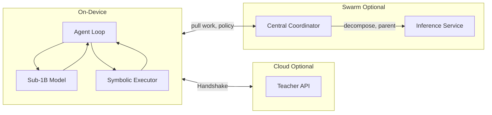
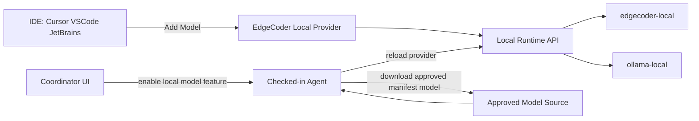
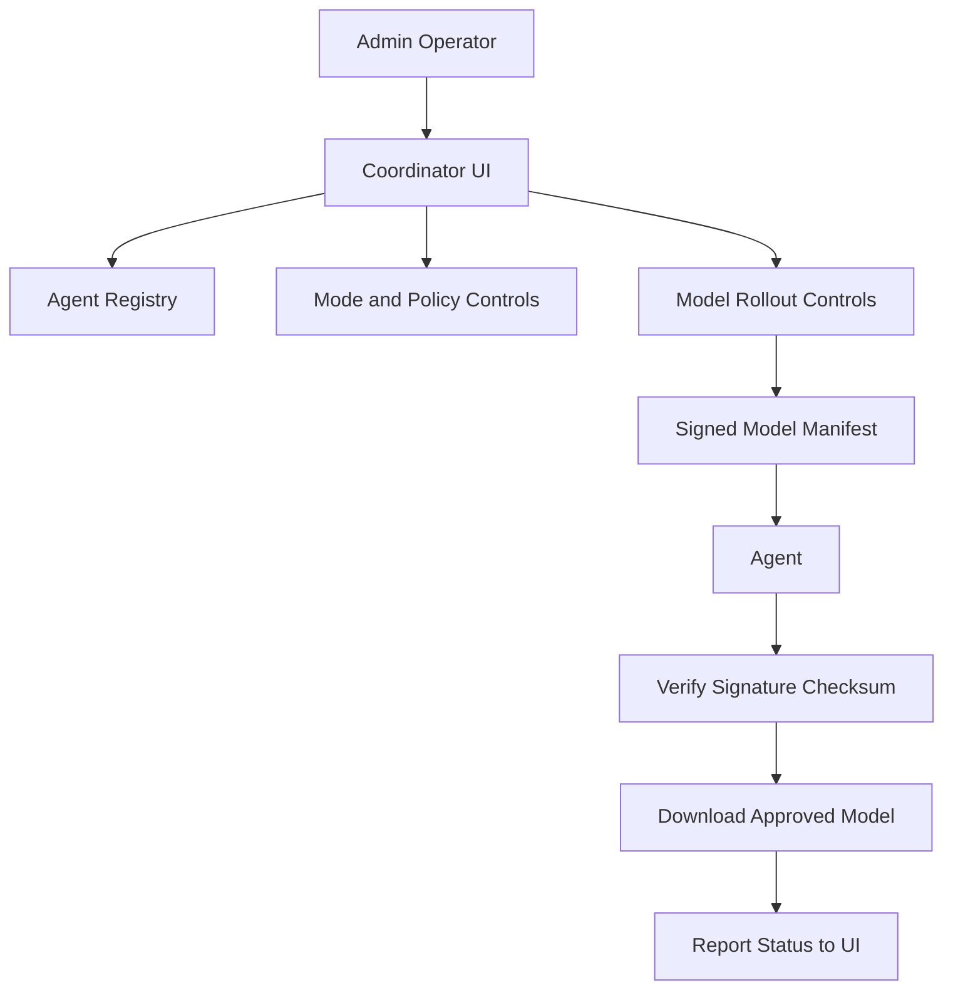

# EdgeCoder: Unified Plan — On-Device Agentic Coding Runtime

**One-line pitch**: The first on-device agentic coder: plan, code, test, and iterate without sending your code to the cloud. Use it local/offline, or join a swarm to amplify capacity across a fleet.

**Overview**: A sub-1B parameter coding agent that runs full plan→code→test→iterate loops on phones, laptops, and edge hardware via a custom distillation/quantization pipeline and an on-device executor for Python/JS subsets. Optional cloud handoff for hard tasks (queued, user notified when improved code is ready). Multifaceted: local-only when offline, or swarm participant when online—many agents pool compute behind a central coordinator that also directs CPU policy so the fleet never destroys machine usability. Distribution via IDE extensions, standalone app, mobile app; marketability via positioning, trust, and monetization tiers.

**How to read this document**:
- Sections `1-14` define architecture, product strategy, and locked decisions.
- Sections `15-17` are execution tools (checklist, RACI, KPI targets).
- If scope conflicts appear, **Section 3 (Design Decisions)** wins.

---

## 1. Vision and Scope

**Product**: A tiny coding agent (sub-1B params) that runs **full agent loops** (plan → code → test → iterate) **entirely on-device**, with optional secure cloud handoff for tasks that exceed local capability. When online, the same agent can **join a swarm** and contribute CPU to fleet work; a central coordinator directs operations and CPU/resource policy.

**Differentiation**:
- **On-device executor** (Python/JS subsets): Safe, deterministic execution and testing without shipping code to the cloud — core IP for low-power inference and privacy.
- **Distillation + quantization pipeline**: Reproducible path from teacher coding model to deployable edge model.
- **Handshake protocol**: Minimal, verifiable cloud delegation only when needed; complex tasks queued, user notified when improved code is ready.
- **Swarm**: Multiple agents pool compute; central coordinator decomposes tasks, runs work queue, aggregates results, and **directs CPU policy** (thresholds, time windows) so fleet work doesn’t overload machines.

**Target platforms**: Phones (iOS/Android), laptops (macOS/Windows/Linux), edge hardware (e.g. Raspberry Pi, Jetson Nano). Desktop agent support is explicit for **Debian**, **Ubuntu**, **Windows**, and **macOS**.

**Competitive moat**: The on-device executor and the distillation pipeline that produces models trained for that executor. Competitors can copy the model size; replicating the executor and the full loop is harder. Roadmap: “From dev-on-a-plane to enterprise air-gap.”

---

## 2. Multifaceted Usage: Local-Only vs. Swarm Participant

- **Local / offline**: When offline (or when you choose not to use the cloud), use EdgeCoder entirely on-device — plan, code, test, iterate. No coordinator required. Optional cloud handoff queues tasks for later; user is notified when improved code is ready.
- **Online swarm participant**: When online, the same agent can **join the fleet** and contribute CPU. The device pulls subtasks from a **central coordination server** (or cluster), runs work locally within **policy limits**, and pushes results back. Central coordinator is **required** for swarm mode; it directs CPU/resource policy so machines are not overloaded.
- **Agent operating modes**: Every enrolled agent supports a server-controlled mode flag: **swarm-only** (headless compute resource only) or **IDE-enabled** (interactive local/offline coding + optional swarm participation).

---

## 3. Design Decisions (Locked In)

These choices are fixed for the plan and build phase:

| # | Topic | Decision |
|---|--------|----------|
| 1 | **Decomposition** | Larger model (not sub-1B) for swarm task decomposition. |
| 2 | **Executor subset** | Code outside the subset → queue for cloud + clear message to user. |
| 3 | **Agent vs worker** | Two code paths from the start: **interactive agent** (IDE/desktop/mobile) vs **swarm worker** (headless batch); shared executor and model only. |
| 4 | **Hard task routing** | Requeue to **coordinator** first; coordinator can call a **parent/larger model** (e.g. cloud or inference service) if it hits its own limits. |
| 5 | **Who runs decomposer** | **Separate inference service**; coordinator calls it via API (scale independently). Coordinator does not run the model itself. |
| 6 | **Merge conflicts** | Escalate to a **parent coordinator** (or higher-level resolver) to resolve; ask humans for context when it lacks context. |
| 7 | **Shared state** | **Multi-step subtasks** with context passed by the coordinator when tasks need shared context (e.g. add field + update call sites). |
| 8 | **Repo for swarm** | **Frozen snapshot** (commit hash or tarball) for every swarm job; no live filesystem. |
| 9 | **Hyperscaler** | Plan explicitly allows **extension to GPU/hyperscaler coordination** (same conductor + queue + policy pattern). |
| 10 | **Ollama on agents** | **Both supported**: Ollama (or similar) optional / dev mode; our own distilled model + runtime as default for product. |
| 11 | **Coordinator AI** | Coordinator is logic-only; decomposition model runs in a **separate inference service** the coordinator calls. |
| 12 | **Swarm sandbox** | **Sandbox required** for swarm workers (e.g. no host FS access, or VM/container); specified in plan for enterprise trust. |

---

## 4. High-Level Architecture

- **Agent loop**: Plan → Code → Test → Iterate; decides when to call the model, run the executor, request cloud help, or (in swarm mode) pull work from the coordinator.
- **Sub-1B model**: Local inference (planning, code generation, reflection).
- **On-device executor**: Safe Python/JS subset; used for testing and iteration without cloud.
- **Handshake**: Secure cloud delegation for hard tasks (queued, notify user when improved code ready).
- **Central coordinator**: Required for swarm; calls **separate inference service** for decomposition; holds work queue, aggregation, and **CPU/resource policy** (thresholds, time windows, idle-only).

---

## 5. Model Pipeline (Distillation + Quantization)

**Goal**: Produce a sub-1B model suitable for edge inference from a strong teacher (e.g. 7B–8B).

- **Distillation**: Teacher (e.g. CodeLlama, StarCoder); student ≤1B (e.g. 350M–1B); token-level KD and optionally response-level alignment; data includes executor-compatible Python/JS subsets. Consider torchtune and encoder-decoder-slm patterns.
- **Quantization**: INT8/INT4 (GPTQ, AWQ, GGUF); target runtimes: MLX (Apple), ONNX Runtime, llama.cpp, TFLite, Core ML.
- **Ollama and our model**: **Both supported** on edge agents. **Ollama** (or similar) is optional / dev mode for fast iteration and validation of the loop. **Our own distilled model + runtime** is the default for product and app-store story (control, footprint, executor-optimized). Support both so users and developers can choose.
- **Deliverables**: Distillation scripts and data format; training config; export/quantization for at least two runtimes.

---

## 6. On-Device Executor (Python/JS Subsets)

**Purpose**: Run generated code and tests locally so the agent can observe pass/fail and iterate without cloud. Core IP for privacy and low-power inference.

- **Safety**: Allowlists/denylists; no arbitrary I/O, eval of unsanitized input, or dangerous imports.
- **Python**: Safe AST subset; sandboxed CPython or custom interpreter/VM.
- **JavaScript**: Safe subset; small engine (e.g. QuickJS, Hermes) in sandbox or custom interpreter.
- **Output**: Structured result (stdout, stderr, return value, exit code) for the agent to decide pass/fail and what to fix.
- **Outside subset**: When the user's code uses constructs outside the executor subset (async, decorators, C extensions, etc.), **queue for cloud** and show a **clear message** to the user (e.g. "This code is outside the on-device subset; queued for cloud review").
- **Repo**: `executor/` with `python/` and `js/` submodules, shared `RunResult` and `run(code, lang, timeout)` API.

---

## 7. Agent Loop (Plan → Code → Test → Iterate)

- **Loop**: Plan → Code → Test (in executor) → Observe → Iterate until success, max steps, or queue for cloud.
- **Two code paths**: (1) **Interactive agent** — full UX (chat, plan/code/test view, retrieval, Apply/Reject); used by IDE, desktop app, mobile. (2) **Swarm worker** — headless, batch subtask only, strict timeout, no chat UI; shared executor and model only. Build both from the start; do not overload one path with both use cases.
- **Components**: Orchestrator (state machine, memory); tools `run_python`, `run_js`, `run_tests`; sub-1B model (or Ollama in dev mode — see Design Decisions); **complex-task queue** — queue and mark for cloud review instead of blocking; notify user when improved code is ready.
- **Memory**: Small context (e.g. 2K–4K tokens); summarization or sliding window.

### 7.1 Retrieval augmentation (QMD)

**QMD** (Query Markup Documents): on-device search (BM25 + vector + LLM re-ranking), MCP tools. Use it to pack more punch without growing the model:

- **RAG in the loop**: Before plan/code, agent calls local retrieval over docs/codebase; sub-1B gets a short, relevant context window.
- **Shared stack**: Reuse small embed/rerank models (e.g. EmbeddingGemma 300M, Qwen3 Reranker 0.6B); main model stays focused on planning and code.
- **Integration**: Retrieval as tools (`search_docs`, `search_code`, `get_snippet`) via QMD MCP or lightweight RAG; on constrained devices, BM25-only or pre-indexed snippets.

**Repo**: `retrieval/` for QMD integration or lightweight RAG.

---

## 8. Handshake Protocol (Cloud for Hard Tasks)

- **Goal**: Securely delegate hard tasks to cloud (or to coordinator/parent model in swarm) without leaking full codebase or PII.
- **When**: Agent or user marks task for cloud review; tasks **queued**, sent when agent has access; user **notified** when updated/improved code is ready. **In swarm**: hard tasks requeue to **coordinator** first; coordinator can call **parent/larger model** (or cloud) if it hits its limits.
- **Payload**: Minimal (task description, plan/code snippet, error); no full repo or PII unless user opts in.
- **Security**: TLS + attestation; short-lived delegation token; optional TEE and verifiable execution for enterprise.
- **Response**: Cloud returns revised plan, code diff, or improved code; device notifies user; **diff view + Accept / Reject / Edit** so user stays in control.
- **Implementation**: REST or gRPC, API key; later attestation and tokens. OpenAPI handshake spec for multiple backends. **Privacy**: “No code leaves the device unless you queue for cloud review”; document in Privacy section and in UI.

---

## 9. User Interfaces and UX

### 9.0 Surface Summary

- **Primary**: IDE integration (Cursor first, then VS Code and JetBrains).
- **Secondary**: Standalone desktop app for quick scripts and demos.
- **Tertiary**: Mobile app for queue/review/approve workflows.

### 9.1 IDE / Editor Integration (Primary)

- Extension or built-in local agent for Cursor, VS Code, and JetBrains.
- Entry points: sidebar and command palette (`EdgeCoder: Plan & code`).
- Interactive flow: plan -> code -> test -> iterate.
- User actions: Apply, Reject, Queue for cloud review.
- Cloud response UX: diff + Accept / Reject / Edit.
- Context sources: file selection, workspace, retrieval tools.

### 9.2 Standalone Desktop App

- macOS/Windows/Linux desktop app with editor + agent panel.
- Same plan/code/test flow as IDE mode.
- Offline-first default for local tasks.

### 9.3 Mobile App

- Task input via text/voice.
- Read-first workflow for plan/code/test and cloud-review updates.
- Key actions: Copy, Share, Queue for cloud, Accept/Reject.
- Heavy editing stays on desktop/IDE.

### 9.4 Shared UX Rules

- Always show execution context: `running locally` vs `queued for cloud`.
- Always return cloud responses as diff + Accept / Reject / Edit.
- Support offline-first behavior with sync on reconnect.
- Provide fast onboarding: templates + one-click `Try it`.

### 9.5 IDE Model Connectivity and "Add Model" Plan

The IDE integration must support a standardized model-connection flow similar to Cursor's **Add Model** behavior.

- **Connection model**: IDE plugin connects to a local EdgeCoder runtime endpoint (localhost API). The runtime can serve either the default distilled sub-1B model or a local Ollama-backed model.
- **Cursor-first UX**: In Cursor, user selects **Add Model** and points to EdgeCoder local provider endpoint. The same adapter pattern is used for VS Code and JetBrains via provider configuration.
- **Provider abstraction**: Implement a model-provider layer with at least two providers: `edgecoder-local` (default distilled model) and `ollama-local` (local Ollama model).
- **Server-controlled feature flag**: In coordinator UI, admin sees all checked-in agents and can enable **Local Model Feature** per agent/group/tenant.
- **Approved model policy**: When local model feature is enabled, agent receives an approved model manifest (model id, source URL/registry, checksum/signature, version constraints).
- **Model provisioning**: Agent downloads approved model directly from allowed source, verifies checksum/signature, stores in local cache, then hot-reloads provider config.
- **Safety controls**: Policy includes allowlist for model sources and model ids; unsupported or unsigned models are rejected.
- **OS support requirement**: Model provisioning and runtime control must work on Debian, Ubuntu, Windows, and macOS.

**Repo**: `apps/` or `clients/` (e.g. `ide-extension/`, `desktop/`, `mobile/`); shared agent API or SDK.

---

## 10. Swarm: Multi-Agent Fleet and Central Coordinator

**Execution path**:
1. Complex task arrives at coordinator.
2. Coordinator calls separate inference service to decompose into subtasks.
3. Subtasks enter durable queue.
4. Agents pull tasks, execute in sandbox, push results.
5. Coordinator aggregates results and applies routing/escalation policy.
6. Hard tasks requeue to coordinator first, then escalate to parent/larger model when needed.

**Central coordinator (required for swarm)**:
- **Task decomposition**: **Model-based** via a **separate inference service** (coordinator calls API); scale decomposition independently. Not rule-only; not sub-1B on coordinator. Coordinator is logic-only (no model running in coordinator process).
- **Work queue**: Durable, scalable (e.g. Redis, RabbitMQ, Kafka); subtasks with metadata; agents pull (claim), run, post result; idempotent task IDs; heartbeat and re-queue on agent timeout.
- **Result aggregation**: Merge patches, concatenate results, or run final validation. **Merge conflicts**: Escalate to a **parent coordinator** (or higher-level resolver) to resolve; **ask humans for context** when the resolver lacks context.
- **Policy service**: **CPU cap**, **memory limit**, **time windows**, **idle-only**, **concurrency**, **backoff**. Policy store (DB or config); versioned; pushed at registration/heartbeat; agents enforce locally.
- **Repo for swarm jobs**: **Frozen snapshot** only — every job gets a commit hash or tarball; no live filesystem so jobs are reproducible and stable.
- **Multi-step subtasks**: When tasks need shared context (e.g. add field to struct X and update all call sites), coordinator can issue **multi-step subtasks** with context passed between steps.
- **Deployment**: Stateless coordinator behind load balancer; queue and DB as shared state. Single server or **cluster** (HA); on-prem or VPC for enterprise. No GPU in coordinator; orchestration and policy only.

**Server-level coordination (efficient handling)**:
- **API**: REST or gRPC for job submit, status, registration, heartbeat, work pull, result push, policy fetch.
- **Inference service**: Separate service (same box or different) for decomposition (and optionally for parent-model escalation); coordinator calls it via API.
- **Audit**: Log job id, subtask id, agent id, timestamps, result hash for compliance.

### 10.1 Coordinator UI, Agent Registry, and Local Model Control

- **Agent registry UI**: Server UI lists all checked-in agents with status, OS, version, mode (swarm-only or IDE-enabled), policy profile, and health.
- **Mode management**: Admin can set per-agent mode: `swarm-only` or `ide-enabled`.
- **Local model toggle**: Admin can enable/disable local model feature per agent/group/tenant.
- **Model rollout controls**: UI supports staged rollouts (canary, batch, full), rollback, and policy inheritance by tenant/team.
- **Download orchestration**: On enable, coordinator pushes signed model manifest; agent downloads from approved source and reports progress/status back to UI.
- **Compliance visibility**: UI shows model provenance, signature verification status, and last successful update per agent.

**Agents (workers)**: Same on-device stack (executor + model); **swarm client** registers, pulls work, runs within **policy limits**, uploads result. **Sandbox required**: Swarm work runs in a **sandbox** (e.g. no host FS access, or VM/container) so enterprises can lock down what the agent touches; specified in plan for trust.

**Enterprise fleet**: Hundreds/thousands of workstations with EdgeCoder; coordinator on-prem; policy e.g. overnight-only or idle-only; code stays on-prem; closed swarm with device attestation; audit log. No datacenter—compute is existing fleet.

**Subtask types**: Full micro-loop (plan+code+test), single-step (inference or executor run), or **multi-step with context**. **Protocols**: Registration (deviceId, attestation, capability → policy); work pull; result push; policy updates on heartbeat.

**Repo**: `swarm/`: coordinator service, **inference service** (or contract for one), swarm client SDK, protocol spec, optional `swarm/contracts` for schemas.

### 10.2 Extension: GPU / Hyperscaler Coordination

The same **conductor + queue + policy** pattern applies to **GPU fleets** (e.g. Google, xAI, hyperscalers) for workload coordination: a central scheduler decomposes jobs into GPU-sized units, queues them, assigns to healthy policy-compliant nodes, aggregates results, and applies policy (max utilization, time windows, fairness). EdgeCoder’s swarm design can be extended or licensed for this use case as a future or partner angle; the coordinator becomes a cluster job manager, and “agents” are GPU workers.

---

## 11. Repository Layout and Phases

**Suggested layout** (under `Edgecoder/` or `edgecoder/` root):

| Area       | Path            | Contents                                                                 |
| ---------- | --------------- | ------------------------------------------------------------------------ |
| Agent      | `agent/`        | Orchestrator, tools, loop logic, context/memory                          |
| Retrieval  | `retrieval/`    | QMD or lightweight RAG (BM25/vector + MCP or lib API)                     |
| Model      | `model/`        | Distillation configs, training, quantization, export                     |
| Executor   | `executor/`     | Python/JS subset runtimes, shared `RunResult` API                        |
| Handshake  | `handshake/`    | Protocol spec, client SDK, example server                               |
| Swarm      | `swarm/`        | Coordinator, **inference service** (or contract), queue, aggregator, policy, swarm client, spec |
| Control    | `control-plane/`| Coordinator UI, agent registry, policy management, model rollout controls, audit views |
| Runtimes   | `runtimes/`     | Wrappers for MLX, ONNX, llama.cpp, etc.                                 |
| Apps       | `apps/`         | IDE extension, desktop app, mobile app (or `clients/`)                 |
| Eval       | `eval/`         | Benchmarks (e.g. EdgeCoder-Eval: executor-safe HumanEval subset)        |

**Phases**:

1. **Executor first**: Python subset executor and `run_python(code)`; then JS. Drive with hand-written prompts or cloud model.
2. **Agent loop**: Plan→code→test→iterate with executor; add retrieval (QMD or lightweight RAG) as tools; validate with cloud or small open model.
3. **Distillation**: Teacher, student, dataset; train and export sub-1B; plug into agent.
4. **Quantization and runtimes**: INT8/INT4; at least two runtimes (e.g. MLX + one mobile).
5. **Handshake**: Protocol, client, minimal server; integrate cloud queue + notify user with diff + Accept/Reject.
6. **User interfaces**: IDE extension (one editor first); standalone desktop app; mobile app (view + cloud review). Implement IDE provider abstraction and Add Model-style onboarding for local providers.
7. **Local model enablement**: Build coordinator UI for checked-in agents, local model feature toggle, approved model manifests, signed download verification, and rollout/rollback controls.
8. **Swarm**: Coordinator (queue, aggregator, policy); **separate inference service** for decomposition; swarm client (two-path: interactive vs worker); **sandbox** for workers; frozen snapshot for jobs; run with 2–3 agents; attestation, overnight scheduling; parent coordinator / human escalation for merge conflicts; explicit support for swarm-only vs IDE-enabled mode.
9. **Cross-OS hardening**: Validate runtime, provisioning, sandbox, and IDE connectivity on Debian, Ubuntu, Windows, and macOS.
10. **Eval and polish**: EdgeCoder-Eval benchmark, latency/accuracy; docs; app store / SDK distribution.

---

## 12. Marketability: Positioning, Trust, Distribution, Monetization

*[Internal business strategy redacted for public release]*

---

## 13. Risks and Mitigations

- **Sub-1B quality**: Queue complex tasks for cloud review; notify user when improved code ready. Hard tasks requeue to coordinator; coordinator can call parent model. Strong distillation data; clear UX (“local first; complex tasks improved in background”).
- **Executor coverage**: Curate training data to match subset; **outside subset → queue for cloud + clear message**. Document limits; expand subset over time.
- **Platform fragmentation**: Single quantization pipeline, multiple runtimes; prioritize one phone and one laptop path first.

**Limitations and critical notes** (acknowledged for build phase):
- **Decomposition** is done by a larger model in a **separate inference service**, not by the edge sub-1B or by rule-only; coordinator stays logic-only.
- **Interactive vs swarm worker** are two code paths from the start (shared executor/model only) to avoid wrong defaults (e.g. retrieval on every batch subtask).
- **Merge conflicts** and **shared-state tasks** have defined escalation: parent coordinator and/or human context; multi-step subtasks with context from coordinator.
- **Swarm jobs** use a **frozen repo snapshot** (commit/tarball); swarm workers run in a **required sandbox** for enterprise trust.

---

## 14. Summary

EdgeCoder at a glance:

- **Core runtime**: On-device agentic coding with a sub-1B default model, plus optional Ollama local provider.
- **Safety boundary**: Python/JS subset executor; unsupported code is clearly queued for cloud review.
- **Hybrid routing**: Hard tasks requeue to coordinator first; coordinator can escalate to parent/larger model.
- **Swarm architecture**: Coordinator is logic-only, decomposition is in separate inference service.
- **Fleet controls**: CPU/resource policy, frozen snapshots, required worker sandbox, and audit.
- **User modes**: `swarm-only` for pure compute agents, `ide-enabled` for interactive offline/local usage.
- **IDE strategy**: Cursor Add Model-style local provider, then VS Code and JetBrains adapters.
- **Control plane**: Server UI can toggle local model feature and manage approved signed model rollouts.
- **Scale path**: Same conductor + queue + policy pattern can extend to GPU/hyperscaler environments.
- **OS target**: Debian, Ubuntu, Windows, and macOS.

---

## 15. Build-Phase Execution Checklist (Readable)

Use this as the execution sequence before implementation sprints.

### Phase 0 - Program Setup
- [ ] Finalize ADRs for all locked decisions in this doc
- [ ] Stand up module skeletons (`agent/`, `executor/`, `swarm/`, `control-plane/`, etc.)
- [ ] Define security baseline (signing, checksums, allowlists, sandbox policy)
- [ ] Enable CI baseline (lint, tests, integration smoke)

### Phase 1 - Executor Core
- [ ] Implement Python/JS subset runtime and `RunResult` contract
- [ ] Add unsupported-construct detection and cloud-queue reason code
- [ ] Validate deterministic timeout/pass/fail behavior

### Phase 2 - Agent Runtime (Two Paths)
- [ ] Implement interactive agent path (IDE/desktop/mobile)
- [ ] Implement swarm worker path (headless batch)
- [ ] Ensure both paths share executor/model contracts only

### Phase 3 - Local Model Providers
- [ ] Implement `edgecoder-local` provider (default)
- [ ] Implement `ollama-local` provider (optional/dev)
- [ ] Add provider health checks and switching behavior

### Phase 4 - IDE Connectivity
- [ ] Implement local provider endpoint (localhost API)
- [ ] Implement Cursor Add Model flow
- [ ] Add adapter interfaces for VS Code and JetBrains

### Phase 5 - Handshake and Cloud Review
- [ ] Implement queue + callback/polling flow for cloud review
- [ ] Enforce minimal payload + redaction policy
- [ ] Implement user-facing diff + Accept/Reject/Edit flow

### Phase 6 - Swarm Coordinator + Inference Service
- [ ] Implement coordinator APIs (register, heartbeat, pull, push, status)
- [ ] Implement separate inference service for decomposition
- [ ] Implement idempotent tasks, retry, and requeue semantics
- [ ] Enforce frozen snapshot input for every swarm job

### Phase 7 - Control Plane and Policy UI
- [ ] Implement agent registry UI with mode and health columns
- [ ] Add local model feature toggle per tenant/group/agent
- [ ] Add signed manifest rollout controls (canary/batch/full + rollback)
- [ ] Add provenance and compliance views

### Phase 8 - Security Hardening
- [ ] Enforce required sandbox for swarm workers
- [ ] Validate attestation + policy checks before assignment
- [ ] Add security tests for unsigned model, bad manifest, and sandbox escape attempts

### Phase 9 - Cross-OS Validation
- [ ] Validate full flow on Debian
- [ ] Validate full flow on Ubuntu
- [ ] Validate full flow on Windows
- [ ] Validate full flow on macOS

### Phase 10 - Eval and Release Readiness
- [ ] Run EdgeCoder-Eval and swarm throughput tests
- [ ] Validate KPI thresholds
- [ ] Finalize docs and release gates

---

## 16. RACI-Style Checklist

Roles:
- **PM**: Product management
- **ARCH**: Architecture lead
- **BE**: Backend/platform engineering
- **ML**: Model/ML engineering
- **SEC**: Security/compliance
- **IDE**: IDE/client engineering
- **SRE**: Reliability/operations
- **QA**: QA/release engineering

| Workstream | R | A | C | I |
|---|---|---|---|---|
| Locked decision ADRs | ARCH | PM | BE, ML, SEC | QA, SRE |
| Executor subset + contracts | BE | ARCH | ML, QA | PM |
| Interactive + swarm worker split | BE | ARCH | IDE, QA | PM |
| Provider abstraction (`edgecoder-local`, `ollama-local`) | ML | ARCH | BE, IDE | PM |
| Cursor Add Model + IDE adapters | IDE | PM | BE, ML | QA |
| Handshake + cloud review path | BE | ARCH | SEC, IDE | PM |
| Coordinator + inference service | BE | ARCH | ML, SRE | PM |
| Control plane (registry, mode, model toggles) | BE | PM | SEC, IDE | SRE, QA |
| Signed manifests + model rollout policy | SEC | ARCH | BE, ML | PM |
| Swarm sandbox enforcement | SEC | ARCH | BE, SRE | PM |
| Cross-OS hardening (Deb/Ubuntu/Win/macOS) | QA | PM | BE, IDE, SRE | ARCH |
| KPI instrumentation + dashboards | SRE | PM | BE, ML | QA |
| Release readiness gate | QA | PM | ARCH, SEC, SRE | All |

---

## 17. KPI Targets (Initial)

Set these for beta, then tighten for GA.

### Product KPIs
- **On-device completion rate**: >= 70% of tasks completed without cloud fallback (beta)
- **Cloud queue usage**: <= 30% of tasks; all queue events have explicit reason code
- **User actionability**: >= 95% of cloud returns include valid diff + Accept/Reject/Edit

### Performance KPIs
- **Interactive p50 first token (laptop tier)**: <= 1.5s
- **Interactive p95 first token (laptop tier)**: <= 3.0s
- **Swarm worker task success rate**: >= 97% (excluding policy-rejected jobs)
- **Coordinator requeue recovery**: >= 99% of timed-out tasks re-assigned within SLA

### Reliability KPIs
- **Coordinator availability**: >= 99.9%
- **Inference service availability**: >= 99.5% (beta), >= 99.9% (GA target)
- **Policy propagation latency**: p95 <= 60s from change to agent effective policy

### Security and Compliance KPIs
- **Signed model verification**: 100% for local-model-enabled agents
- **Unsigned model acceptance**: 0%
- **Sandbox compliance**: 100% of swarm workers run in enforced sandbox mode
- **Audit completeness**: 100% of task lifecycle events logged (submit, assign, complete/requeue)

### Fleet and OS KPIs
- **Cross-OS pass rate**: >= 95% critical-path test pass on Debian/Ubuntu/Windows/macOS
- **Model provisioning success**: >= 98% successful signed model downloads on first attempt
- **Agent check-in freshness**: >= 99% active agents heartbeat within configured interval

---

## 18. Security Guarantees (Current Enforced Baseline)

These are hard guarantees for current production intent and implementation:

- **Coordinator is mesh-internal**: coordinator routes require `x-mesh-token`; unauthenticated public requests are rejected.
- **No direct public model API**: Ollama is bound to localhost on coordinator runtime and is not exposed as a public edge route.
- **Agent-mediated model access**: model execution is reachable through authenticated agent/coordinator flows, not anonymous coordinator calls.
- **IDE requires local agent**: IDE connectivity is through local authenticated agent runtime; IDE clients do not call coordinator model endpoints directly.
- **Control-plane remains admin-gated**: admin token and IP allowlist policies protect operational and orchestration endpoints.
- **Stable Fly runtime policy**: use Ollama provider with pre-pulled models and avoid startup-time auto-pull in production to reduce availability risk.
