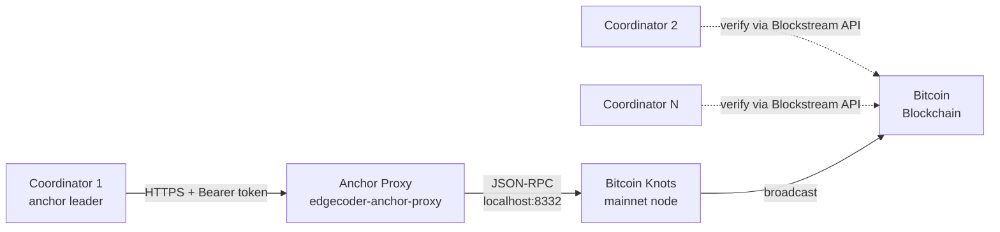

# Bitcoin Anchoring

EdgeCoder coordinators anchor checkpoint and issuance epoch hashes to the Bitcoin blockchain using OP_RETURN transactions. This provides cryptographic finality: once anchored, checkpoint integrity can be verified by anyone with access to a Bitcoin node or block explorer.

## Architecture


```mermaid
flowchart LR
  C1[Coordinator 1<br/>anchor leader]
  C2[Coordinator 2]
  CN[Coordinator N]
  AP[Anchor Proxy<br/>edgecoder-anchor-proxy]
  BK[Bitcoin Knots<br/>mainnet node]
  BC[Bitcoin<br/>Blockchain]

  C1 -->|HTTPS + Bearer token| AP
  C2 -.->|verify via Blockstream API| BC
  CN -.->|verify via Blockstream API| BC
  AP -->|JSON-RPC<br/>localhost:8332| BK
  BK -->|broadcast| BC
```

## How it works

1. **Stats checkpoints** are computed from the coordinator's stats ledger hash chain. Every 10 minutes, the anchor leader checks for a new finalized checkpoint.

2. **Issuance epochs** are finalized via quorum consensus among coordinators. Once finalized, the anchor leader anchors the epoch hash.

3. The anchor leader encodes the checkpoint hash into an OP_RETURN payload with a 35-byte format: `"EC"` prefix (2 bytes) + version byte (`0x01`) + SHA-256 hash (32 bytes).

4. The OP_RETURN transaction is broadcast via the anchor proxy, which forwards to the Bitcoin Knots node over local JSON-RPC.

5. The coordinator polls for block confirmations. Once the transaction has the required confirmations (default: 1), the anchor status is promoted from `pending` to `anchored`.

## Anchor leader election

Only one coordinator per mesh broadcasts each checkpoint to avoid duplicate transactions.

The **anchor leader** is the coordinator with the lexicographically smallest `peerId` among all reachable mesh peers (including itself). This is deterministic and requires no extra messages. If the current leader goes offline, the next coordinator in sort order automatically takes over.

Non-leader coordinators verify anchors via the public Blockstream or mempool.space API.

## Anchor proxy service

The anchor proxy is a lightweight authenticated HTTPS service that sits between the coordinator mesh and the Bitcoin node.

**Why a proxy?**

- Coordinators never hold bitcoind RPC credentials
- No IP whitelisting is needed when new coordinators join the mesh
- Only a single service has access to the wallet private keys
- Rate limiting prevents runaway broadcast costs

**Endpoints:**

| Method | Path | Auth | Description |
|--------|------|------|-------------|
| `POST` | `/anchor/broadcast` | Bearer | Broadcast an OP_RETURN transaction |
| `GET` | `/anchor/confirm/:txid` | Bearer | Check confirmation status of a txid |
| `GET` | `/anchor/find/:dataHex` | Bearer | Reconciliation: txid of the wallet tx whose OP_RETURN carries `dataHex`, or `null` |
| `GET` | `/anchor/mempool/:txid` | Bearer | Reconciliation: whether an unconfirmed tx is still in the mempool |
| `POST` | `/anchor/abandon` | Bearer | Reconciliation: `abandontransaction` for a dropped tx (`{ "txid": "..." }`) |
| `GET` | `/health` | None | Basic node health (for Fly health checks) |
| `GET` | `/health/detailed` | Bearer | Full node + wallet + rate limit status |

**Environment variables (anchor proxy service):**

| Variable | Required | Description |
|----------|----------|-------------|
| `ANCHOR_PROXY_TOKEN` | Yes | Bearer token for authenticating coordinator requests |
| `BITCOIND_RPC_URL` | Yes | Bitcoin node JSON-RPC endpoint |
| `BITCOIND_RPC_USER` | Yes | RPC username |
| `BITCOIND_RPC_PASSWORD` | Yes | RPC password |
| `BITCOIND_WALLET_NAME` | No | Wallet name (default: empty) |
| `BITCOIN_NETWORK` | No | Network label (default: `signet`) |
| `MAX_BROADCASTS_PER_MINUTE` | No | Rate limit (default: `10`) |

## Provider types

| Provider | Use case | Env value |
|----------|----------|-----------|
| **anchor-proxy** | Production (recommended) | `BITCOIN_ANCHOR_PROVIDER=anchor-proxy` |
| **bitcoind** | Direct RPC access to a local node | `BITCOIN_ANCHOR_PROVIDER=bitcoind` |
| **blockstream** | Read-only confirmation checking | `BITCOIN_ANCHOR_PROVIDER=blockstream` |
| **mock** | Development and testing | `BITCOIN_ANCHOR_PROVIDER=mock` |

## Coordinator environment variables

| Variable | Required | Description |
|----------|----------|-------------|
| `BITCOIN_ANCHOR_PROVIDER` | Yes | Provider type (see above) |
| `BITCOIN_NETWORK` | Yes | Must match across all coordinators in the mesh |
| `ANCHOR_PROXY_URL` | When using anchor-proxy | URL of the anchor proxy service |
| `ANCHOR_PROXY_TOKEN` | When using anchor-proxy | Bearer token matching the proxy |
| `ANCHOR_CONFIRMATION_POLL_MS` | No | Poll interval for pending anchors (default: `60000`) |
| `STATS_ANCHOR_MIN_CONFIRMATIONS` | No | Required confirmations (default: `1`) |
| `BITCOIN_ANCHOR_CONFIRMATIONS` | No | Confirmations before an anchor counts as `anchored` (default: `6`) |
| `BITCOIN_ANCHOR_DAILY_BUDGET_SATS` | No | Daily anchoring budget in sats (default: `200000`). A broadcast is refused when (broadcasts in the last 24h + 1) × `BITCOIN_ANCHOR_MAX_FEE_SATS` would exceed it, so the default allows 10 anchors/day at the default fee cap. `0` disables broadcasting. |
| `BITCOIN_ANCHOR_MAX_FEE_SATS` | No | Absolute fee cap per anchor tx (default: `20000`) |
| `BITCOIN_ANCHOR_MIN_FEE_SAT_VB` | No | Fee-rate floor in sat/vB (default: `2`) |
| `BITCOIN_ANCHOR_MAINNET` | For mainnet | Must be `1` to broadcast when `BITCOIN_NETWORK=bitcoin`; mainnet anchoring is opt-in |
| `ANCHOR_RECONCILE_MS` | No | How often to reconcile in-flight and stuck anchors; also runs at startup (default: `900000`) |
| `ANCHOR_RECONCILE_MAX_ATTEMPTS` | No | Failed lookups before a `broadcasting` row is flagged `needs_admin` (default: `5`) |
| `ANCHOR_STUCK_AFTER_MS` | No | A pending tx this old that is unconfirmed and not in the mempool is marked `failed` and re-anchored (default: `21600000`, 6h) |
| `ANCHOR_ABANDON_WATCH_MS` | No | How long an abandoned tx is watched in case it confirms anyway (default: `259200000`, 72h) |

### Reconciliation (#103)

A `broadcasting` row means the coordinator stopped between broadcasting and storing the txid. On startup and every `ANCHOR_RECONCILE_MS`, the coordinator searches the bitcoind wallet for a transaction whose OP_RETURN carries that checkpoint. If it finds one, it stores the txid and tracks confirmations as usual. If the wallet definitely has no such transaction, the row becomes `failed` and is re-anchored. If the node can't answer, the coordinator counts an attempt. After `ANCHOR_RECONCILE_MAX_ATTEMPTS` failed attempts the row becomes `needs_admin` (logged as `bitcoin_anchor_needs_admin_reconcile`). That checkpoint is then never re-broadcast automatically. An operator checks the wallet and sets the row's `tx_ref`/`status` by hand. Wallet lookup needs `BITCOIN_ANCHOR_PROVIDER=bitcoind` or `anchor-proxy`. With other providers, in-flight rows go to `needs_admin`.

Before a stuck `pending` tx is marked `failed`, the coordinator calls bitcoind `abandontransaction` on it so its inputs are released and a re-anchor can't conflict with the old tx. If that call fails, or the provider can't abandon transactions, the row stays `pending` and the failure counts as an attempt. Each reconcile pass re-reads a row under the checkpoint lock and skips it if it changed since it was listed. An abandoned transaction keeps its txid and is watched for `ANCHOR_ABANDON_WATCH_MS` (default `259200000`, 72h). If it confirms anyway, the row goes back to `pending` and then `anchored`, and its fee counts toward the daily budget for the 24h after it confirmed. `needs_admin` rows also count toward the budget, since they may have spent sats. The final fee of a recovered transaction is not re-checked against `BITCOIN_ANCHOR_MAX_FEE_SATS`.

## Verification

Operators can verify any checkpoint hash on-chain:

```bash
# Check coordinator anchor status
curl -s -H "x-mesh-token: $MESH_AUTH_TOKEN" \
  "https://coordinator.edgecoder.io/stats/anchors/verify?checkpointHash=<HASH>"

# Check anchor proxy health
curl -s -H "Authorization: Bearer $ANCHOR_PROXY_TOKEN" \
  https://edgecoder-anchor-proxy.fly.dev/health/detailed

# View transaction on Blockstream
open "https://blockstream.info/tx/<TXID>"
```

## Security considerations

- The Bitcoin wallet private keys never leave the Bitcoin Knots node. Signing happens server-side via JSON-RPC.
- The anchor proxy only accepts requests with a valid Bearer token.
- Rate limiting prevents runaway broadcast costs (default: 10 per minute).
- Cross-network checkpoint messages from peers with a different `BITCOIN_NETWORK` are rejected with a peer score penalty.
- Chain reorganization detection automatically demotes anchors if their transaction disappears from the longest chain.

## Related

- [Settlement Lifecycle](/economy/settlement-lifecycle)
- [Credits, Pricing, Issuance](/economy/credits-pricing-issuance)
- [Coordinator Signing Identity](/reference/coordinator-signing-identity)
- [Environment Variables](/reference/environment-variables)
