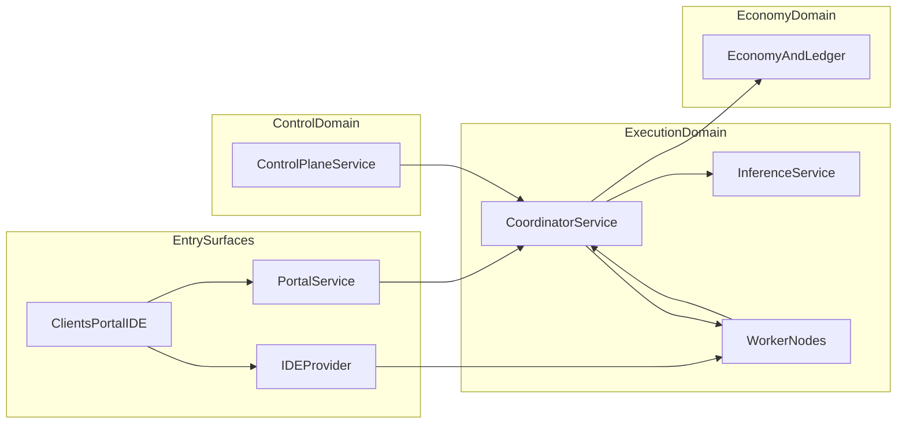
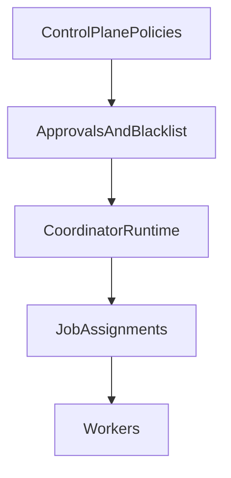

# Architecture Deep Dive

This page expands the high-level guide into a system-level architecture view.
It is derived from `EDGECODER_PLAN.md`, `README.dev.md`, and operations/security docs.

## Core Services and Responsibilities

## Agent Runtime

- Two primary paths:
  - interactive path (developer-facing, local-first)
  - worker path (headless swarm participation)
- Uses execution + model provider contracts shared across modes.
- Handles plan/code/test/iterate workflow for coding tasks.

## Executor

- Enforces allowed language/runtime subset boundaries.
- Provides controlled execution for generated code paths.
- Feeds execution/test results back into the agent loop.

## Coordinator

- Orchestration-only role for mesh execution.
- Assigns tasks by capacity/policy, tracks health, and aggregates results.
- Keeps model access mediated rather than exposing direct public model APIs.

## Inference Service

- Split from coordinator to isolate decomposition/inference scaling.
- Receives decomposition/model requests from coordinator workflows.
- Can enforce token-gated access in production setups.

## Control Plane

- Exposes operator APIs for:
  - network mode
  - rollout policy
  - approvals
  - security/blacklist workflows
- Serves as a governance/control boundary rather than execution boundary.

## Portal

- User identity and account lifecycle:
  - signup/login
  - OAuth
  - passkey support
- Node enrollment, wallet onboarding, credits and operations views.

## High-Level Topology

## Control Plane vs Runtime Plane

## Runtime Modes

## Local-First Mode

- Work stays local when policy requires private-only execution.
- Swarm coordination is optional.
- Best fit for regulated or sensitive code paths.

## Public Mesh Mode

- Work can be distributed to approved external nodes.
- Coordinator tracks capacity, quality, and eligibility.
- Contribution and demand signals feed issuance/economy layers.

## Enterprise Overlay Mode

- Adds stricter controls around identity, trust, and boundary enforcement.
- Designed for higher-assurance environments and policy-heavy operators.

## Design Constraints Carried Through the Stack

- Separation of concerns: coordinator vs inference vs control plane vs portal.
- Explicit trust boundaries: auth, routing, runtime, and economy controls.
- Auditable state: ledger verification and tamper-evident records.
- Deployable independence: services can scale and roll independently.

## Source Layout Mapping

From `README.dev.md`:

- `src/agent`: interactive + worker loops
- `src/executor`: subset validation and execution helpers
- `src/swarm`: coordinator + worker runtime
- `src/inference`: decomposition/inference service
- `src/control-plane`: admin and deployment APIs
- `src/apps/ide`: IDE provider endpoint
- `src/mesh`: peer registration/gossip/protocol handling
- `src/security`: blacklist and abuse-control flows
- `src/credits`, `src/economy`, `src/ledger`: accounting and verification primitives

## Related pages

- [How EdgeCoder Works](/guide/how-edgecoder-works)
- [Public Mesh Operations](/operations/public-mesh-operations)
- [Trust and Security](/security/trust-and-security)
- [Credits, Pricing, and Issuance](/economy/credits-pricing-issuance)
