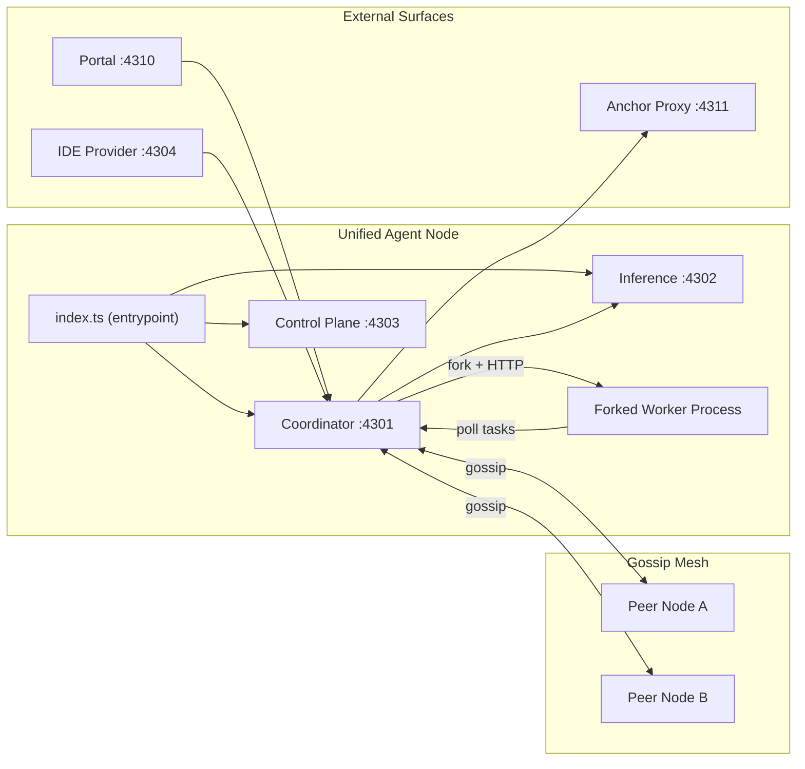
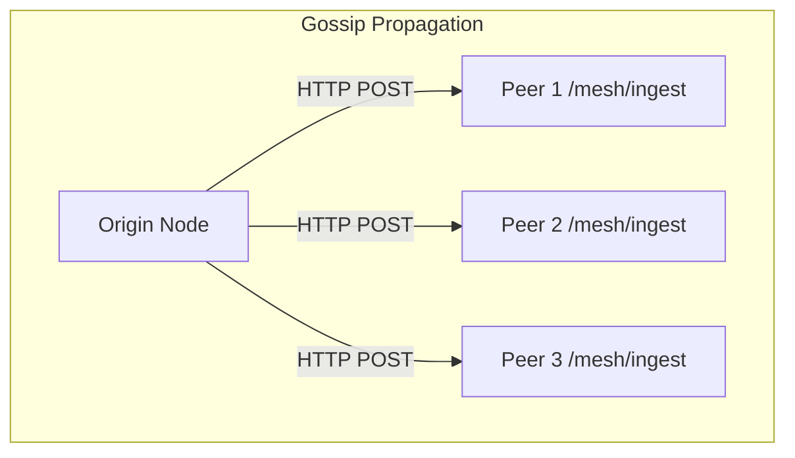

# Architecture Deep Dive

This page describes the current unified agent architecture. Every node in the EdgeCoder mesh runs a single process that embeds the coordinator, inference service, control plane, and a forked worker. There is no separate coordinator/worker deployment model.

## Unified Agent Model

Every node executes `src/index.ts`, which starts three co-located services in one process:

| Port | Service | Description |
|------|---------|-------------|
| 4301 | Coordinator | Task queue, agent registration, mesh endpoints |
| 4302 | Inference | Model routing, Ollama proxy, status |
| 4303 | Control Plane | Admin API, deployment manifests, coordinator discovery |
| 4304 | IDE Provider | OpenAI-compatible chat completions for external IDEs |
| 4310 | Portal | User auth, wallets, passkeys (separate deployment) |
| 4311 | Anchor Proxy | Bitcoin RPC proxy for ledger anchoring |

After the services bind, `startWorkerProcess()` forks a worker that connects back to its own coordinator over HTTP on port 4301. This makes every node both a coordinator and a worker simultaneously.

## Boot Sequence

```
1. index.ts starts coordinatorServer on port 4301
2. Inference service starts on port 4302
3. Control plane starts on port 4303
4. initCoordinator() initializes:
   - task queue
   - gossip mesh
   - ledger
   - background tasks (health checks, reaping, anchoring)
5. Worker process is forked
   - registers with coordinator
   - begins polling for tasks
```

Once step 5 completes the node is fully operational: it can accept tasks from the mesh, execute them locally, and gossip state to peers.

## High-Level Topology



## Gossip Mesh

The `GossipMesh` class in `src/mesh/gossip.ts` handles peer-to-peer state propagation:

- Broadcasts to peers via HTTP POST to `/mesh/ingest` on each known peer's coordinator port.
- Peers are discovered through the `COORDINATOR_BOOTSTRAP_URLS` environment variable.
- Capability gossip broadcasts each agent's available models, resource class, and capacity across the mesh so coordinators can route tasks to capable nodes.
- A gossip claim delay prevents duplicate task execution when multiple nodes race to claim the same task.



## Coordinator Internals

The coordinator on port 4301 owns:

- **Task queue** -- accepts task submissions, tracks state (queued, claimed, running, complete, failed), and exposes polling endpoints for workers.
- **Agent registration** -- workers register on startup and send periodic heartbeats; stale agents are reaped.
- **Mesh endpoints** -- `/mesh/ingest` for gossip, `/mesh/peers` for peer discovery, capability broadcast ingestion.
- **Ledger integration** -- records credit transactions for task execution, anchors to Bitcoin on interval.

## Inference Service

The inference service on port 4302 provides:

- Model routing to local Ollama instances or remote providers.
- Proxy endpoints that normalize request/response formats.
- Status and health reporting for available models.
- The coordinator calls the inference service when a task requires model evaluation.

## Control Plane

The control plane on port 4303 exposes:

- Admin API for network configuration and operational state.
- Deployment manifest verification and distribution.
- Coordinator discovery for multi-node setups.
- Policy enforcement hooks (approvals, blacklist, rollout).

## Desktop App (Tauri + Svelte)

The desktop application is built with Tauri (Rust backend) and Svelte (frontend). It connects to all local services on ports 4301 through 4304.

**Layout:** Chat-first interface with two primary tabs -- Chat and Editor. The Editor tab embeds a Monaco editor with an integrated chat panel for inline code assistance.

**Pages (12 total):**

| Page | Purpose |
|------|---------|
| ChatView | Primary conversational interface |
| EditorView | Monaco editor with chat panel |
| Dashboard | Node status, task metrics, mesh health |
| Settings | Configuration for services, models, network |
| ModelManager | Install, remove, and configure Ollama models |
| TaskQueue | View and manage queued/running/completed tasks |
| MeshTopology | Visual map of connected mesh peers |
| Credits | Credit balance, transaction history |
| Account | User profile, wallet, passkeys |
| ActiveWork | Currently executing tasks and progress |
| LogViewer | Streaming logs from all services |
| LoginScreen | Authentication entry point |

**Storage:** IndexedDB for conversation persistence. localStorage for user settings and UI state.

## Security Stack

All security primitives are shipped and active unless noted otherwise.

- **Ed25519 request signing and verification** -- every inter-service and mesh request is signed; receivers verify before processing.
- **Nonce-based replay prevention** -- each signed request includes a unique nonce; duplicates are rejected.
- **Per-agent sliding window rate limiting** -- prevents any single agent from overwhelming the coordinator or inference service.
- **Blacklist audit chain** -- blacklist entries include evidence hashing to produce a tamper-evident record of abuse actions.
- **Manifest verification** -- deployment manifests for model packages are signature-checked before execution.
- **Envelope encryption (X25519 + AES-256-GCM)** -- implemented and staged for activation; provides end-to-end encryption for sensitive payloads between nodes.

## Economy

- **Credit engine** -- supports four transaction types: `earn`, `spend`, `adjust`, and `held`. Balances are tracked per agent in the ledger.
- **Dynamic pricing** -- task cost scales with current system load and the resource class of the executing node.
- **Bitcoin anchoring** -- the anchor proxy on port 4311 writes ledger state hashes to Bitcoin via `OP_RETURN` outputs, providing an external tamper-evident checkpoint.
- **Lightning Network settlement** -- integrates with LND for fast credit settlement between nodes.

## Source Layout

| Directory | Responsibility |
|-----------|---------------|
| `src/index.ts` | Entrypoint; starts all services, forks worker |
| `src/agent` | Interactive and worker agent loops |
| `src/executor` | Language subset validation and sandboxed execution |
| `src/swarm` | Coordinator and worker runtime |
| `src/inference` | Inference service, model routing |
| `src/control-plane` | Admin API, deployment manifests |
| `src/apps/ide` | IDE provider (OpenAI-compatible endpoint) |
| `src/mesh` | Gossip mesh, peer registration, protocol handling |
| `src/security` | Signing, nonces, rate limiting, blacklist |
| `src/credits`, `src/economy`, `src/ledger` | Credit engine, pricing, Bitcoin anchoring |

## Related Pages

- [How EdgeCoder Works](/guide/how-edgecoder-works)
- [Public Mesh Operations](/operations/public-mesh-operations)
- [Trust and Security](/security/trust-and-security)
- [Credits, Pricing, and Issuance](/economy/credits-pricing-issuance)
