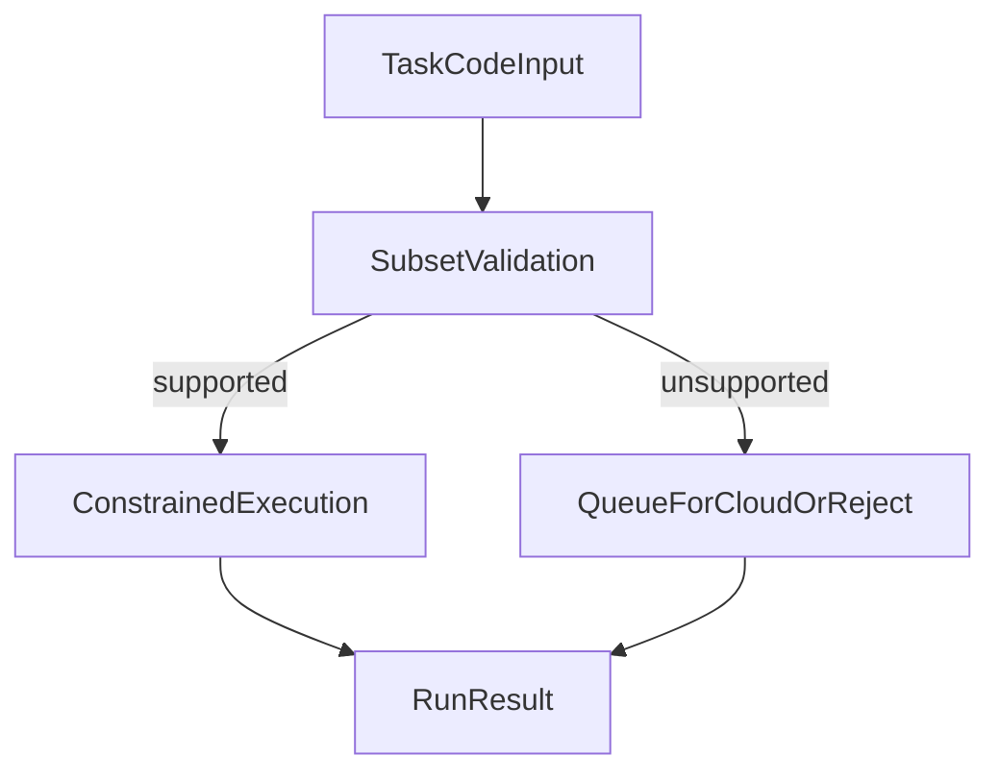

# Executor Sandbox and Isolation

The executor is a core safety boundary in EdgeCoder.
It decides whether generated code can run in constrained local runtime or must be rejected/queued.

## Design goals

- Limit unsafe language/runtime features.
- Keep execution deterministic enough for automated retries.
- Provide explicit reason codes for non-runnable payloads.

## Execution decision flow

## Run result contract (conceptual)

| Field | Purpose |
|---|---|
| `ok` | high-level success/failure flag |
| `stdout` | captured standard output |
| `stderr` | captured error output |
| `exitCode` | process result code |
| `durationMs` | execution duration for telemetry and policy |
| `queueForCloud` | indicates fallback path |
| `queueReason` | explains subset/policy/runtime fallback reason |

## Isolation concerns

- No implicit trust in generated code.
- Restrict language subset and dangerous constructs.
- Bound resource usage and timeout behavior.
- Return structured errors so the agent loop can recover/rewrite.

## Operator checks

- Verify fallback rates do not spike unexpectedly.
- Track common `queueReason` values to improve prompt/executor alignment.
- Keep runtime policy consistent across worker fleets.

## Related pages

- [Executor Subset Reference](/operations/executor-subset-reference)
- [Threat Model](/security/threat-model)
- [Request Lifecycle Sequences](/guide/request-lifecycle-sequences)
