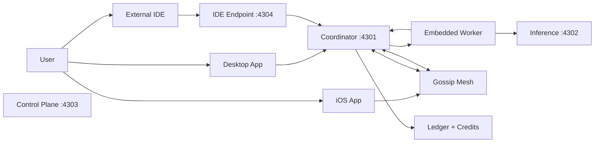

# How EdgeCoder Works

This page describes the EdgeCoder runtime architecture end to end: from node startup through task execution and settlement.

## Unified Agent Architecture

Every EdgeCoder node runs as a **unified agent** -- a single process that embeds both a coordinator and a worker. There is no separate coordinator deployment. When a node boots:

1. The coordinator starts on **port 4301** and initializes the task queue, credit engine, ledger, and peer mesh.
2. A worker process is forked automatically. Every node contributes compute to the mesh.
3. The inference service binds to **port 4302** (local Ollama).
4. The control plane binds to **port 4303**.
5. An OpenAI-compatible endpoint starts on **port 4304** for external IDE connections.

This means any machine running EdgeCoder is simultaneously coordinating work and performing work.

## Gossip Mesh

Nodes discover and communicate with each other via a gossip mesh. Each node broadcasts state to peers over HTTP at `/mesh/ingest`. The mesh handles:

- Peer discovery and liveness
- Task availability broadcasts
- Claim coordination with gossip claim delay to prevent duplicate execution
- Ledger synchronization

No central server or registry is required. The network is fully peer-to-peer.

## System Components

| Component | Role |
|---|---|
| **Coordinator** (port 4301) | Task queue, credit engine, ledger, peer mesh management |
| **Inference Service** (port 4302) | Local model execution via Ollama |
| **Control Plane** (port 4303) | Network mode controls, agent approvals, governance |
| **IDE Endpoint** (port 4304) | OpenAI-compatible API for VS Code, Cursor, Windsurf |
| **Embedded Worker** | Picks tasks from the local coordinator queue, executes them |

## User Interfaces

### Desktop App (Tauri + Svelte)

Chat-first IDE with Monaco editor, conversation history, model management, mesh topology view, task queue, and credits dashboard. This is the primary surface for interacting with EdgeCoder.

### External IDEs

VS Code, Cursor, and Windsurf connect to the node via the OpenAI-compatible endpoint on port 4304. Users get EdgeCoder inference inside their existing editor without switching tools.

### iOS App

Mobile agent running llama.cpp for on-device inference. Connects to the local mesh over BLE for proximity-based peer discovery.

## Task Flow

1. **Submission** -- User submits a task via the desktop chat UI or an external IDE.
2. **Queueing** -- The local coordinator places the task on its queue.
3. **Broadcast** -- The gossip mesh broadcasts task availability to peer coordinators.
4. **Claiming** -- An available worker (local or on a remote peer) claims the task. A gossip claim delay prevents duplicate claims across the mesh.
5. **Execution** -- The worker runs a plan, code, test, iterate loop against its local model.
6. **Result return** -- Results flow back to the originating coordinator. Credits are accrued to the agent that contributed compute.

## Economy

EdgeCoder uses a credit-based economy to incentivize compute contribution:

- **Earning credits**: Nodes earn credits by executing tasks for other peers. The credit engine records verified work against the ledger.
- **Spending credits**: Submitting a task to the mesh costs credits proportional to the compute required.
- **Bitcoin anchoring**: Ledger checkpoints are anchored to Bitcoin via `OP_RETURN` transactions, providing tamper-evident proof of the ledger state.
- **Lightning Network**: Real-time settlement between peers uses Lightning for low-latency, low-fee payments.

## Runtime Modes

### Local-Only

All tasks execute on the local node. The gossip mesh is inactive or restricted. Suitable for air-gapped environments or privacy-sensitive workloads.

### Mesh (Default)

The node participates in the peer mesh. Tasks can overflow to remote peers when local capacity is saturated, and the node accepts inbound tasks from the mesh to earn credits.

## Trust Boundaries

- **Identity**: Session and permission checks at task ingress.
- **Execution**: Workers run in constrained environments. Scheduling policy determines node eligibility per task class.
- **Network**: Mesh endpoints require peer authentication. The inference service is not exposed directly to the mesh.
- **Economy**: Credit accounting, issuance, and settlement are isolated from execution paths. Ledger verification provides auditability.

## Where to Go Deeper

- Architecture details: [Architecture Deep Dive](/guide/architecture-deep-dive)
- Operations: [Public Mesh Operations](/operations/public-mesh-operations)
- Security: [Trust and Security](/security/trust-and-security)
- Economy: [Credits, Pricing, and Issuance](/economy/credits-pricing-issuance)
- API reference: [API Surfaces](/reference/api-surfaces)
