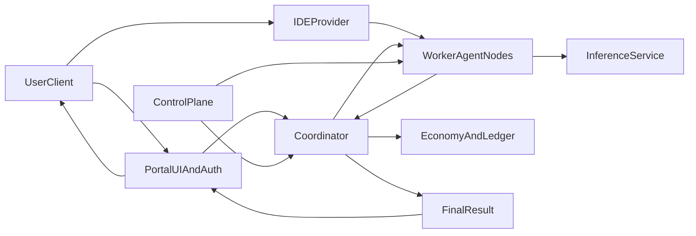

# How EdgeCoder Works End to End

This page explains the full EdgeCoder runtime from user request to execution, verification, and settlement.
It combines the architecture plan, operational docs, and developer runbooks into one end-to-end view.

## System Actors

- **User**: initiates coding or operations requests through the portal and other clients.
- **Portal**: handles identity, account, node enrollment, wallet onboarding, and operations views.
- **Coordinator**: orchestrates swarm work, enforces policy, tracks node capacity, and aggregates results.
- **Worker / Agent Nodes**: execute tasks in constrained runtime, report status, and return artifacts/results.
- **Inference Service**: handles decomposition and model-side inference requests as a separate service boundary.
- **Control Plane**: network mode controls, agent/coordinator approvals, blacklist governance, and rollout controls.
- **Economy + Ledger Services**: credit accounting, sats conversion/quotes, issuance windows, and tamper-evident records.

## End-to-End Request Lifecycle

1. **Request intake**
   - The user submits an action from a client surface (portal, IDE-connected workflows, or automation paths).
   - Identity and session checks run at ingress.
2. **Policy and eligibility checks**
   - The system validates permissions, trust constraints, and routing policy.
   - Workload is classified for local-only or mesh-capable execution.
3. **Scheduling and assignment**
   - The coordinator evaluates available capacity and node eligibility.
   - Jobs are assigned to one or more worker nodes, optionally with decomposition through inference service.
4. **Execution**
   - Worker nodes perform coding/runtime tasks in sandboxed conditions and emit status/telemetry.
   - Inference services provide model outputs required by each stage.
5. **Aggregation and result return**
   - The coordinator aggregates outputs, resolves partial retries/failures, and returns a final response.
   - The portal reflects outcomes and operational state to users.
6. **Accounting and reward flow**
   - Effective contribution and demand are recorded to credit/ledger systems.
   - Issuance and payout windows are recomputed on rolling windows according to network policy.

## Runtime Modes and Surfaces

### Local-Only Runtime

- Designed for privacy-sensitive or offline-first workflows.
- Interactive agent loop can run with local model providers and local execution boundaries.
- Cloud handoff remains optional for hard tasks, with explicit user control.

### Swarm Runtime

- Agent nodes join coordinator-managed mesh execution.
- Coordinators split and route work by capacity/policy and aggregate multi-node results.
- Inference runs as a dedicated service and does not require exposing model API directly from coordinator.

### Primary user and operator surfaces

- **Portal UI**: account, auth, node enrollment, wallet/credits, coordinator operations dashboard.
- **IDE provider**: local endpoint for IDE integration (model discovery and local model usage).
- **Control plane APIs**: operator-level fleet, approval, mode, security, and rollout controls.

## Local-Only vs Swarm Participation

## Local-Only Mode

- Sensitive work can remain on privately controlled infrastructure.
- Routing policies can force job execution to trusted local nodes.
- External participation can be disabled while keeping operational controls intact.

## Swarm / Public Mesh Mode

- Work can overflow to approved external compute when demand exceeds local capacity.
- Node participation, effort signals, and scheduler policy drive assignment quality.
- Settlement and issuance mechanics reward verified work over rolling windows.

## Data and Control Flow

## Trust Boundaries and Security Controls (Expanded)

- **Identity boundary**
  - Email/password, OAuth (Google/Microsoft), and passkeys gate user access.
  - Coordinator-owner and system-admin controls gate high-impact operations.
- **Execution boundary**
  - Worker execution is sandboxed with subset checks and constrained runtime expectations.
  - Scheduling policy determines node eligibility for each task class.
  - Local-only constraints can block public routing for sensitive workloads.
- **Network boundary**
  - Coordinator routes require mesh authentication for internal operations.
  - Direct model serving from coordinator is intentionally restricted.
  - Health/status endpoints provide explicit observability and runtime checks.
- **Economy boundary**
  - Pricing, issuance, and payout paths are separated from execution APIs.
  - Allocation and issuance use rolling windows and ledger verification guarantees.

## End-to-End Sequence (Narrative)

1. User starts from portal or IDE-connected path.
2. Identity is established; node/account context is resolved.
3. Task intent is classified for local path vs mesh path.
4. Coordinator receives schedulable workload and checks policy constraints.
5. Inference may decompose work into structured subtasks.
6. Eligible workers pull/accept work, execute in constrained runtime, and report results.
7. Coordinator aggregates results and computes final response state.
8. Economy/ledger services record usage, credits, and contribution signals.
9. Portal displays outcomes, balances, and operator-facing telemetry.

## Where to go deeper

- Architecture details: [Architecture Deep Dive](/guide/architecture-deep-dive)
- Operations details: [Public Mesh Operations](/operations/public-mesh-operations)
- Security details: [Trust and Security](/security/trust-and-security)
- Economy details: [Credits, Pricing, and Issuance](/economy/credits-pricing-issuance)
- API map: [API Surfaces](/reference/api-surfaces)

## Operational References

- [Public Mesh Operations](https://github.com/your-org/Edgecoder/blob/main/docs/public-mesh-operations.md)
- [Agent and Coordinator Install](https://github.com/your-org/Edgecoder/blob/main/docs/agent-and-coordinator-install.md)
- [Security Baseline](https://github.com/your-org/Edgecoder/blob/main/docs/security-baseline.md)
- [EdgeCoder Unified Plan](https://github.com/your-org/Edgecoder/blob/main/EDGECODER_PLAN.md)
