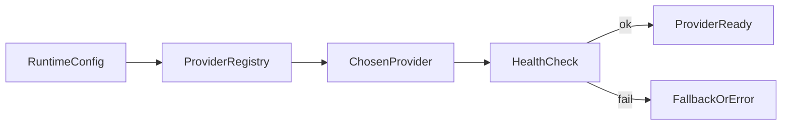

# Model Provider Abstraction

EdgeCoder separates orchestration from model implementation through a provider abstraction.
This allows switching providers while preserving the same higher-level task workflow.

## Provider options

- `edgecoder-local`
  - default local provider path
  - optimized for local-first behavior and predictable startup
- `ollama-local`
  - integrates local or remote Ollama endpoint
  - useful for model experimentation and self-hosted variants

## Why the abstraction exists

- Keep agent loop stable across provider changes.
- Avoid coupling coordinator logic to a single model backend.
- Support environment-specific rollout (developer laptop vs production node).

## Selection flow

## Runtime considerations

- Keep provider startup behavior explicit in deployment scripts.
- Use health checks before accepting work.
- Document default model tags per runtime profile.
- For Ollama, ensure `OLLAMA_HOST` and model availability are validated early.

## Configuration keys

| Variable | Purpose |
|---|---|
| `LOCAL_MODEL_PROVIDER` | Select provider implementation |
| `OLLAMA_AUTO_INSTALL` | Control automatic model pull behavior |
| `OLLAMA_MODEL` | Default model tag for Ollama runtime |
| `OLLAMA_HOST` | Local/remote Ollama endpoint |
| `IOS_OLLAMA_MODEL` | Optional iOS worker default model |

## Related pages

- [Executor Sandbox and Isolation](/guide/executor-sandbox-isolation)
- [Runtime Modes](/reference/runtime-modes)
- [Environment Variables](/reference/environment-variables)

## llama.cpp (iOS)

iOS devices use llama.cpp for on-device inference with GGUF model files. The `LocalModelManager` handles model lifecycle:

- Download GGUF files from EdgeCoder CDN
- SHA-256 checksum verification
- Load into llama.cpp context
- Generate completions via `llama_decode` / `llama_sampling`
- Single model in memory (iPhone RAM constraint)

### Model Quality Multiplier

Credit earnings scale with model capability to incentivize running larger models:

| Model Size | Multiplier | Example |
|---|---|---|
| 7B+ parameters | 1.0x | Full credit rate |
| 3B-7B | 0.7x | 70% credit rate |
| 1.5B-3B | 0.5x | 50% credit rate |
| < 1.5B | 0.3x | 30% credit rate |

### Runtime Model Swap

Models can be swapped at runtime via:
- **iOS**: ModelLibraryView UI → `LocalModelManager.activate(modelId)`
- **Node.js**: `POST /model/swap` HTTP endpoint

Both trigger BLE re-advertisement and heartbeat capability updates.
