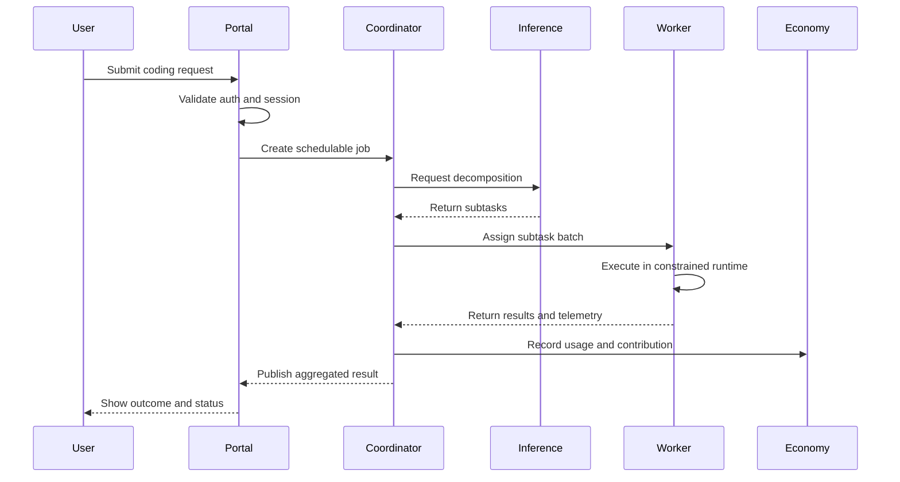
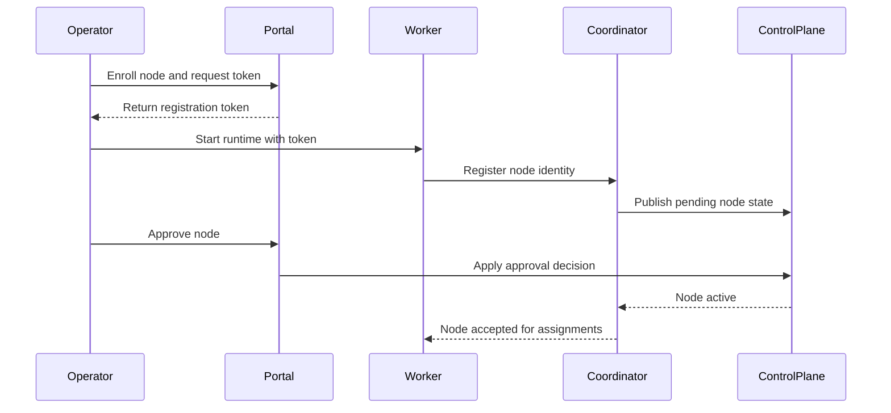
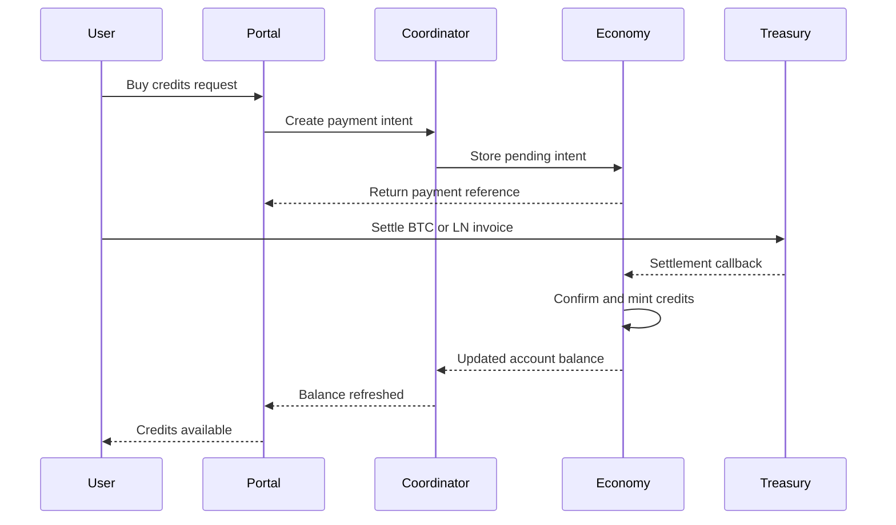

# Request Lifecycle Sequences

This page provides concrete sequence diagrams for critical EdgeCoder flows.
It complements the architecture pages with operator-friendly execution detail.

## 1) User Request Through Portal to Swarm Completion

## 2) Node Enrollment and Activation

## 3) Payment Intent to Credit Mint

## Operational Notes

- Sequence boundaries map to service ownership boundaries.
- Retries and partial failures are expected and should be idempotent.
- Auth checks happen at ingress and again at sensitive service boundaries.
