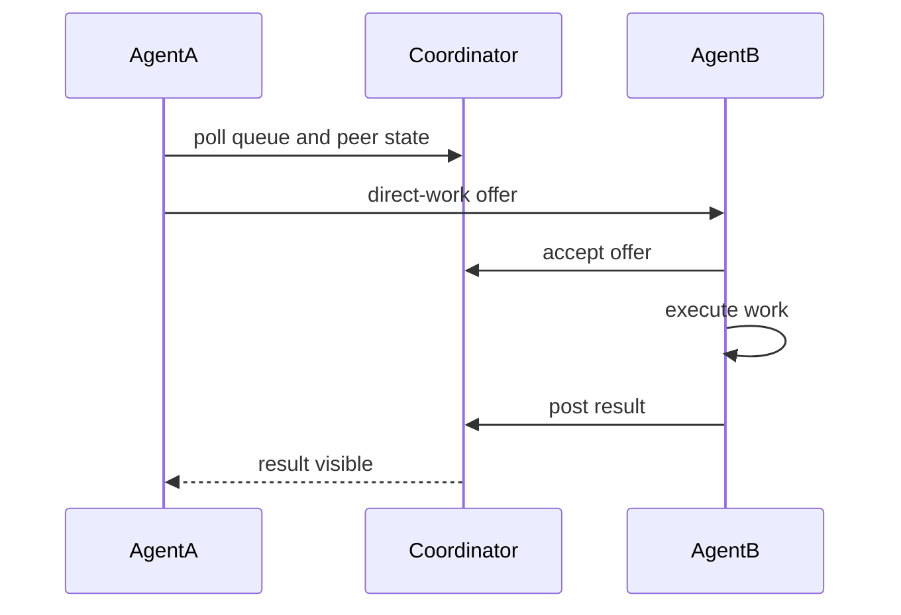

# Agent Mesh Peer-Direct Flow

Peer-direct allows participating agents to exchange work through coordinator-governed flows.
It improves utilization while preserving auditability and policy controls.

## Sequence: offer -> accept -> execute -> result

## Core endpoint families

- `/agent-mesh/direct-work/offer`
- `/agent-mesh/direct-work/accept`
- `/agent-mesh/direct-work/result`
- `/agent-mesh/direct-work/audit`
- relay/tunnel routes for peer communication paths

## Rate and abuse controls

Key controls typically include:

- offer rate caps
- relay request caps
- tunnel relay minute-level limits
- blacklist enforcement and coordinator-side validation

## Operational guidance

- Keep direct-work audit logs retained and queryable.
- Monitor acceptance vs completion ratio to detect unhealthy peers.
- Use coordinator policy to quarantine unstable or abusive nodes.

## Cross-links

- [Public Mesh Operations](/operations/public-mesh-operations)
- [Role-based Runbooks](/operations/role-based-runbooks)
- [Threat Model](/security/threat-model)
