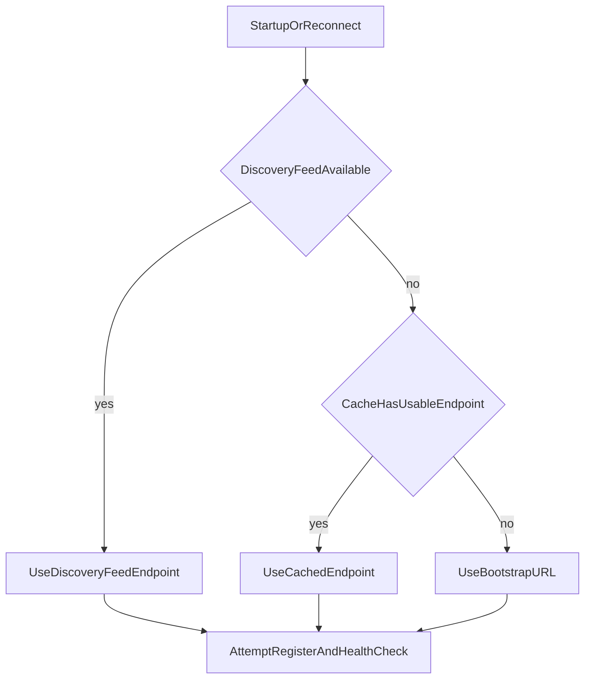

# Coordinator Discovery and Failover

Agents and coordinators must resolve active coordinator endpoints reliably.
EdgeCoder uses ordered discovery with cache and bootstrap fallback.

## Resolution order

## Data sources

- Discovery feed from control-plane network endpoints.
- Local cache file for last known good coordinator.
- Bootstrap URL as deterministic fallback.

## Common configuration keys

| Variable | Purpose |
|---|---|
| `CONTROL_PLANE_URL` | base for discovery feed |
| `COORDINATOR_DISCOVERY_URL` | explicit discovery feed override |
| `COORDINATOR_CACHE_FILE` | local worker cache file |
| `COORDINATOR_BOOTSTRAP_URLS` | fallback coordinator seed list |
| `COORDINATOR_PEER_CACHE_FILE` | local coordinator peer cache |

## Failure patterns and recovery

- **Discovery unavailable**: rely on cache/bootstrap, retry with backoff.
- **Stale cache endpoint**: health-check reject, fall through to next source.
- **Split-brain peer data**: prefer verified coordinator health and policy state.

## Cross-links

- [Deployment Topology](/operations/deployment-topology)
- [Public Mesh Operations](/operations/public-mesh-operations)
- [Runtime Modes](/reference/runtime-modes)
