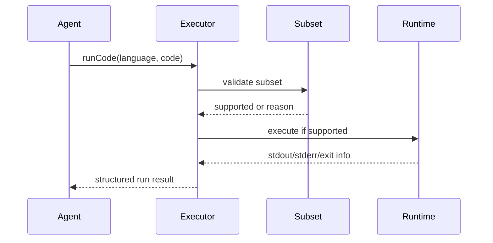

# Executor Subset Reference

This page documents the practical subset model used by executor safety checks.
Use it as an operator/developer quick-reference for why work may fallback.

## Subset philosophy

- Support predictable, constrained execution.
- Reject language/runtime features that break safety or determinism goals.
- Return explicit fallback reason codes.

## Conceptual categories

| Category | Typical behavior |
|---|---|
| Basic syntax and pure logic | usually supported |
| Unrestricted filesystem/network access | usually restricted |
| Dynamic code evaluation patterns | usually restricted |
| High-risk process/system control | restricted |

## Validation to result path

## Fallback reasons (examples)

- `outside_subset`
- `timeout`
- `runtime_error`
- policy-specific restriction reasons

## Operating recommendations

- Track fallback reason distribution by project/workload type.
- Tune prompts and task decomposition to stay inside supported subset.
- Escalate unsupported patterns to cloud-review path only when policy allows.

## Cross-links

- [Executor Sandbox and Isolation](/guide/executor-sandbox-isolation)
- [Threat Model](/security/threat-model)
