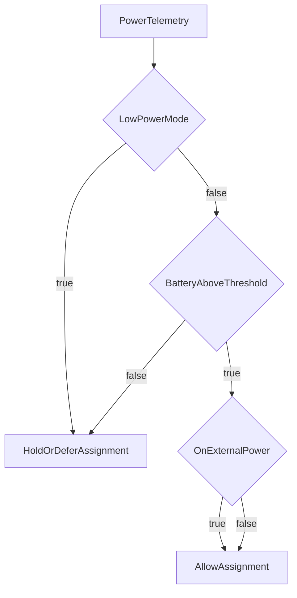

# iOS Power Scheduling

iOS workers can contribute in swarm mode with power-aware scheduling controls.
This page summarizes telemetry fields and coordinator-side policy expectations.

## Why power-aware scheduling exists

- Prevent draining participant devices.
- Prefer assignments when device power conditions are healthy.
- Maintain reliability for long-running tasks.

## Telemetry inputs

| Signal | Meaning |
|---|---|
| `IOS_ON_EXTERNAL_POWER` | device is charging/external power connected |
| `IOS_BATTERY_LEVEL_PCT` | battery percentage reported by worker |
| `IOS_LOW_POWER_MODE` | iOS low power mode state |

## Policy controls

| Variable | Purpose |
|---|---|
| `IOS_BATTERY_PULL_MIN_INTERVAL_MS` | throttle between assignment attempts on battery |
| `IOS_BATTERY_TASK_STOP_LEVEL_PCT` | minimum battery level before stopping assignment |

## Assignment decision sketch

## Operator practices

- Keep iOS fleet policy conservative by default.
- Track assignment drop reasons to understand power-policy impact.
- Use separate worker pools if mobile and desktop reliability goals diverge.

## Cross-links

- [Public Mesh Operations](/operations/public-mesh-operations)
- [Role-based Runbooks](/operations/role-based-runbooks)
