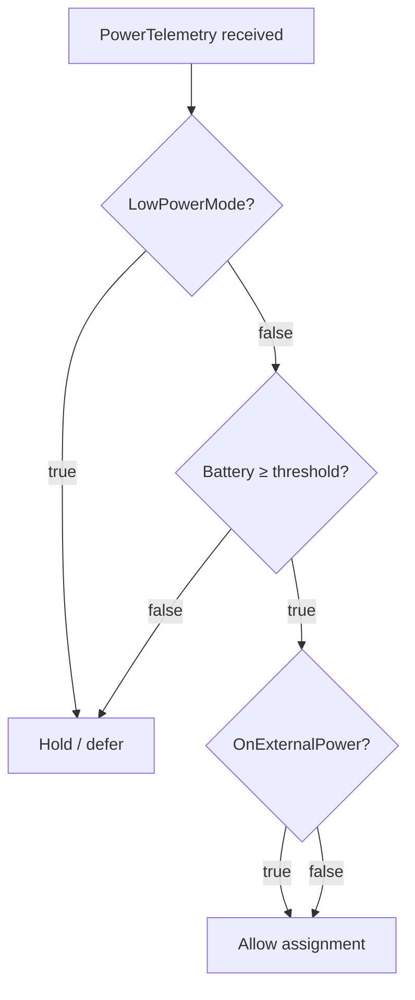

# iOS Agent — Background Execution & Compute Modes

iOS workers can contribute compute in three modes with full background execution and Bluetooth-local fallback. This page documents the compute mode system, background task scheduling, power-aware policy, and Bluetooth Local transport.

## Compute modes

| Mode | Description | Rewards |
|---|---|---|
| **Off** | App is idle; no compute offered. | None |
| **On** | Connects to the internet swarm via coordinator heartbeat loop. | Yes |
| **Bluetooth Local** | Advertises compute over CoreBluetooth to nearby Mac nodes; no internet required. | No |

Mode is controlled via the three-way picker in the **Swarm** tab (`ComputeMode` enum). The selected mode is persisted to `UserDefaults` and restored on next launch.

### Automatic mode downgrade

When the device is in **On** mode and the network path becomes unsatisfied (Wi-Fi drops, airplane mode), `NWPathMonitor` automatically switches the agent to **Bluetooth Local** mode and logs an event. When internet returns, the app notifies the user but does not auto-escalate back — the user must switch back to **On** manually to avoid silently re-enrolling in the rewards network.

## Background execution

### UIBackgroundModes declared

```xml
<key>UIBackgroundModes</key>
<array>
  <string>fetch</string>
  <string>processing</string>
  <string>bluetooth-central</string>
  <string>bluetooth-peripheral</string>
</array>
```

### BGTaskScheduler tasks

| Task ID | Type | Purpose |
|---|---|---|
| `io.edgecoder.ios.runtime` | `BGProcessingTask` | Long-running compute burst; keeps heartbeat loop alive while backgrounded. Re-schedules itself on expiry for continuous coverage. |
| `io.edgecoder.ios.heartbeat` | `BGAppRefreshTask` | Short-lived 15-minute wake for a single heartbeat when the processing task is not running. |

Both tasks are registered in `AppDelegate.application(_:didFinishLaunchingWithOptions:)`. Background tasks are scheduled automatically when the app enters the background (via `UIApplication.didEnterBackgroundNotification`) if `computeMode != .off`.

### Scheduling flow

```
App → Background
  └─ if computeMode != .off:
       BGProcessingTaskRequest(id: "io.edgecoder.ios.runtime", requiresNetworkConnectivity: false)
       BGAppRefreshTaskRequest(id: "io.edgecoder.ios.heartbeat", earliestBeginDate: +15min)

iOS grants BGProcessingTask:
  └─ sendHeartbeatIfNeeded() every 15s
  └─ Re-schedules itself before expiry
  └─ task.setTaskCompleted(success:) on cancellation

iOS grants BGAppRefreshTask:
  └─ One sendHeartbeatIfNeeded() call
  └─ Re-schedules next BGAppRefreshTask
```

### Entitlements required

```xml
<key>BGTaskSchedulerPermittedIdentifiers</key>
<array>
  <string>io.edgecoder.ios.runtime</string>
  <string>io.edgecoder.ios.heartbeat</string>
</array>
<key>com.apple.developer.bluetooth-always-authorization</key>
<true/>
```

## Power-aware scheduling

| Signal | Meaning |
|---|---|
| `onExternalPower` | Charging / external power connected |
| `batteryLevelPct` | Battery percentage (0–100) |
| `lowPowerMode` | iOS Low Power Mode active |

These are reported to the coordinator in every heartbeat's `powerTelemetry` payload. The `runOnlyWhileCharging` toggle (persisted in `UserDefaults`) gates the `start()` call: if true and not on external power, the runtime refuses to start with a status message.

### Assignment decision



## Bluetooth Local transport

When in **Bluetooth Local** mode, `BluetoothTransport` makes the iPhone act as a **CBPeripheralManager** (BLE server):

### BLE service layout

| UUID suffix | Characteristic | Properties | Role |
|---|---|---|---|
| `...0002` | `requestChar` | write / writeWithoutResponse | Mac sends inference request JSON |
| `...0003` | `responseChar` | notify / read | Phone sends inference result back |
| `...0004` | `statusChar` | notify / read | Phone pushes `modelState` + `batteryPct` |

Service UUID: `EC0D-0001-EC0D-EC0D-EC0D-EC0D0001EC0D`

### Wire protocol (JSON over BLE)

**Request** (Mac → Phone, written to `requestChar`):
```json
{ "id": "<uuid>", "prompt": "<text>", "maxTokens": 512 }
```

**Response** (Phone → Mac, notified on `responseChar`):
```json
{ "id": "<uuid>", "output": "<text>", "ok": true, "durationMs": 450 }
```

**Status** (Phone → Mac, notified on `statusChar`):
```json
{ "modelState": "ready", "batteryPct": 87 }
```

Responses larger than 512 bytes are chunked and sent sequentially with 10ms pauses between chunks.

### Mac-side integration

The Mac worker-runner acts as a **CBCentralManager** — scans for peripherals advertising the EdgeCoder service UUID, subscribes to `responseChar` and `statusChar`, and writes inference requests to `requestChar`. When the Mac detects network loss (`NWPathMonitor`), it automatically switches to Bluetooth Local mode and routes all inference requests to the discovered phone peripheral.

## Operator practices

- Keep iOS fleet policy conservative by default (low battery threshold, `runOnlyWhileCharging` for intensive models).
- Track assignment drop reasons to understand power-policy impact.
- Use separate worker pools for mobile vs desktop if reliability goals diverge.
- Bluetooth Local mode is unrewarded — communicate this clearly to users.

## Cross-links

- [Public Mesh Operations](/operations/public-mesh-operations)
- [Role-based Runbooks](/operations/role-based-runbooks)
- [Environment Variables](/reference/environment-variables)
