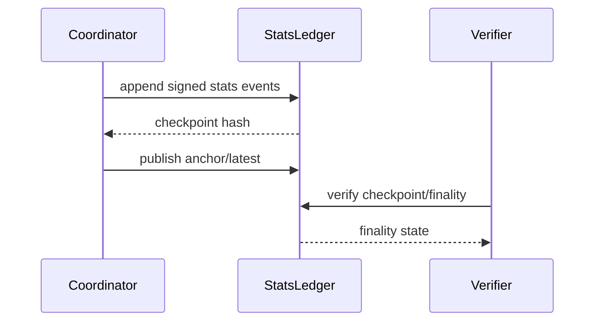

# Stats Ledger Rollout

The stats ledger rollout introduces stronger integrity guarantees in phases.
This page summarizes operational phases and finality states.

## Phased rollout model

## Phase 1: dual-write shadow mode

- Continue primary projections.
- Write signed stats events in parallel.
- Compare without changing primary read path.

## Phase 2: federated read mode

- Read from federated projections.
- Validate parity with existing operational metrics.
- Resolve data drift before strict finality gates.

## Phase 3: quorum-enforced mode

- Enforce quorum checks and anchor lifecycle for stronger guarantees.
- Treat unresolved drift as blocking for critical accounting actions.

## Finality states (conceptual)

| State | Meaning |
|---|---|
| `soft_finalized` | locally consistent but not anchored |
| `anchored_pending` | anchor submitted, awaiting confirmations |
| `anchored_confirmed` | anchored and confirmed |
| `stale_federation` | federated view stale or incomplete |

## Verification sequence

## Cross-links

- [Credits, Pricing, Issuance](/economy/credits-pricing-issuance)
- [Settlement Lifecycle](/economy/settlement-lifecycle)
- [Threat Model](/security/threat-model)
