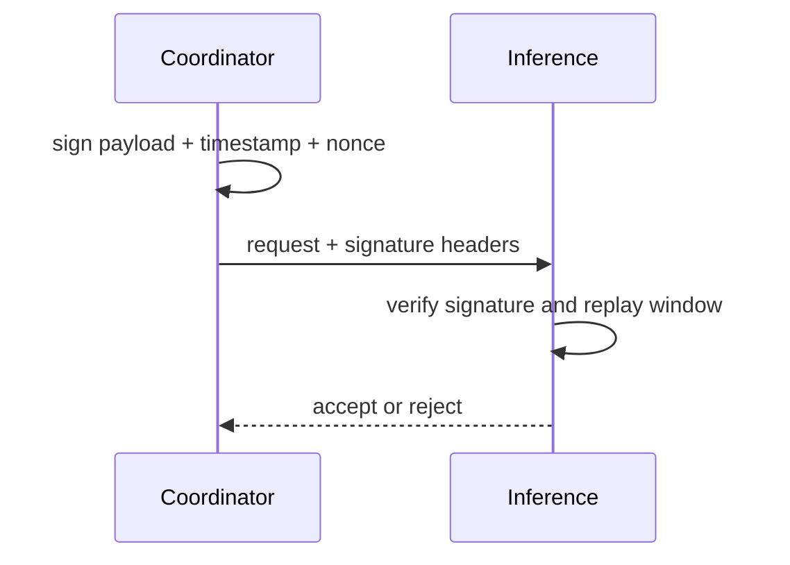

# Coordinator Signing Identity

Coordinator identity and signing keys support mesh trust and replay-resistant verification paths.

## Identity objectives

- Give coordinators durable identity across restarts.
- Support signed internal requests where configured.
- Improve trust decisions for peer and security workflows.

## Key variables

| Variable | Purpose |
|---|---|
| `COORDINATOR_PEER_ID` | durable logical peer identity |
| `COORDINATOR_PRIVATE_KEY_PEM` | signing key material |
| `COORDINATOR_PUBLIC_KEY_PEM` | public verification key |
| `INFERENCE_REQUIRE_SIGNED_COORDINATOR_REQUESTS` | enforce signed coordinator-to-inference requests |

## Signed request model (conceptual)

## Operational practices

- Persist key material outside ephemeral runtime.
- Rotate keys with planned coordinator maintenance windows.
- Keep trusted key sets synchronized across verification boundaries.

## Related pages

- [Trust and Security](/security/trust-and-security)
- [Threat Model](/security/threat-model)
