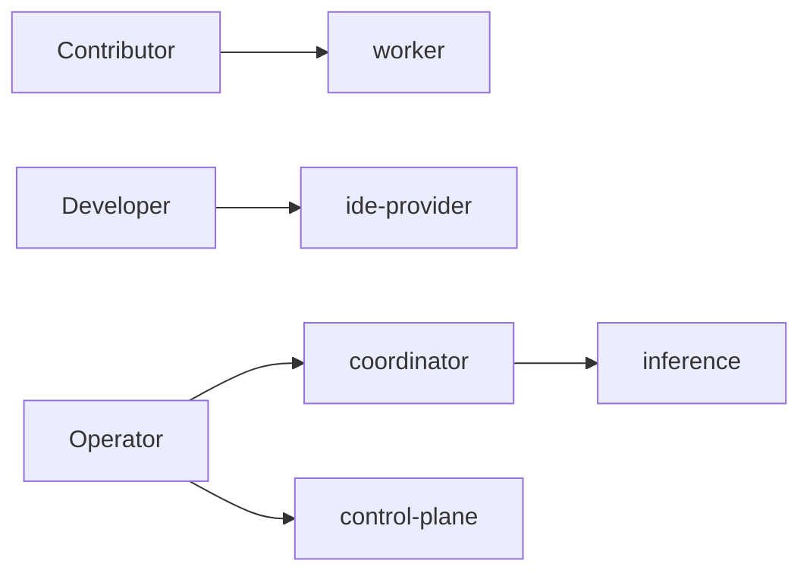

# Runtime Modes

EdgeCoder supports multiple runtime profiles to separate responsibilities by machine/service.

## Runtime mode matrix

| Mode | Primary responsibility |
|---|---|
| `worker` | participate as swarm execution node |
| `ide-provider` | serve local model/provider endpoint for IDE |
| `coordinator` | run coordinator orchestration service |
| `control-plane` | run operator/admin API surface |
| `inference` | run decomposition/inference service |
| `all-in-one` | demo or compact environment running multiple roles |

## Worker sub-modes

| Variable | Options | Meaning |
|---|---|---|
| `AGENT_MODE` | `swarm-only`, `ide-enabled` | worker contribution mode |
| `AGENT_CLIENT_TYPE` | implementation label | telemetry/runtime flavor marker |

## Service boundary reminder

- Production usually favors split services (portal, control-plane, coordinator, inference).
- Local demos may use compact modes but should not erase trust boundaries in policy docs.

## Role-to-mode mapping

## Cross-links

- [Role-based Runbooks](/operations/role-based-runbooks)
- [Environment Variables](/reference/environment-variables)
- [Deployment Topology](/operations/deployment-topology)
