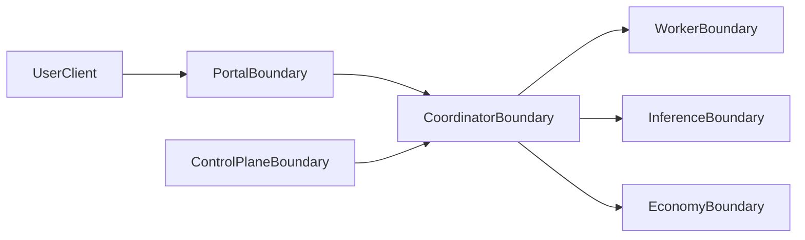

# Threat Model

This model focuses on practical threats and mitigations across service boundaries.

## Trust Boundary Diagram

## Primary Threat Classes

| Threat | Boundary | Risk | Mitigations |
|---|---|---|---|
| Unauthorized API access | portal/control/coordinator | account takeover or misuse | auth checks, role gates, token enforcement |
| Rogue node participation | coordinator/worker | workload integrity and data exposure risk | enrollment tokens, approval workflow, blacklist propagation |
| Tampered runtime execution | worker | incorrect or unsafe execution | constrained execution model, subset/sandbox controls |
| Model supply-chain drift | inference/model source | untrusted model behavior | approved source policy, rollout controls, integrity validation |
| Economic record manipulation | economy/ledger | payout and credit corruption | append-only verification, audit checks, reconciliation |
| Replay or forged internal requests | coordinator/inference | workflow spoofing | signed requests, nonce/timestamp validation |

## Defense Strategy

- **Prevent**: strong identity, strict routing policy, least-privilege roles.
- **Detect**: health checks, audit records, anomaly monitoring.
- **Respond**: isolate affected nodes, pause assignment paths, reconcile state.
- **Recover**: staged re-enable with verification and post-incident review.

## References

- [Security Baseline](https://github.com/codyrs82/Edgecoder/blob/main/docs/security-baseline.md)
- [Trust and Security](/security/trust-and-security)
